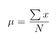
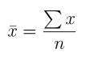
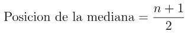
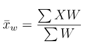
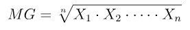
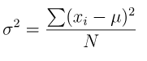
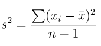
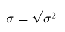
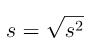

# Medidas de Tendencia Central
Las medidas de tendencia central sirven para resumir o representar un conjunto de datos mediante un solo valor que indica el centro o punto medio de la distribución.
**En otras palabras**, nos ayudan a identificar el valor típico o más representativo de un conjunto de datos.
# Medidas de Tendencia Central para Datos no Agrupados
## Media Aritmética
La media aritmética es una medida de tendencia central que indica el valor **típico** o **central** de un conjunto de datos. 
En otras palabras, nos da una idea general de **dónde están ubicados los datos** en promedio.
- Representa el centro de gravedad de los datos
- es útil para comparar grupos
- nos da una idea de cuanto es lo **normal** o esperado dentro de una población o muestra
### Media Poblacional

### Media Muestral

## Mediana
La mediana es el valor centrar de un conjunto de datos **ordenados**.

### Pasos para encontrarla
1. Ordenar los datos de menor a mayor.
2. Si la cantidad de datos en impar, la mediana es el número que está justo en medio.
3. Si la cantidad de datos es par, la mediana se calcula sacando el **promedio** de los dos valores centrales.

### Posicion de la mediana

## Moda
La moda es el valor o los valores que más se repiten en un conjunto de datos.
Se calcula por observación en datos no agrupados.
- Puede ser multimodal

## Media Ponderada
La media ponderada es una medida en la que cada valor **tiene un peso o importancia diferente**.
En lugar de sumar todos los valores por igual, **algunos valores cuentan más que otros**.

### Fórmula

## Media Geométrica
La media geométrica proporciona una medida precisa de un cambio porcentual promedio en una serie de números.

Es el valor promedio **multiplicativo** de un conjunto de datos.

- Es el promedio adecuado cuando se trabaja con tasas de crecimiento, porcentajes o índices
- Refleja un crecimiento proporcional
- Es útil para comparar rendimientos compuestos (interés, crecimiento económico, etc.)
### Para qué se usa
- Para tasas de variación (crecimientos, porcentajes, intereses compuestos).

- En índices económicos y financieros (como el IPC o ROI compuesto).

- Cuando los datos están en escala multiplicativa.

- Cuando no quieres que valores extremos dominen tanto el promedio.

### Precauciones
- Solo se usa con valores positivos. Si hay ceros o negativos, la media geométrica no está definida.

- No se interpreta igual que la media aritmética: es más conservadora (tiende a ser menor).

Se calcula multiplicando todos los valores y luego se extrae la raíz enésima donde n es la cantidad de datos.
### Fórmula

En resumidas cuentas, la media geometrica representa el cambio porcentual con el tiempo.

# Medidas de Dispersión
Las medidas de dispersión son herramientas que nos indican cuánto se alejan los datos respecto a una medida de tendencia central, como la media.

Es decir, nos dicen qué tan **dispersos**, **concentrados** o **separados** están los datos entre sí.

## Varianza
La varianza mide cuanto se **dispersan** los datos con respecto a la media.

Indica que tan separados o juntos están los **valores de un conjunto**.
### Fórmula
Varianza Poblacional: 

Varianza Muestral: 

## Desviación Estándar
La desviación estándar mide cuánto se alejan los datos, en promedio, respecto a la media.

### Fórmula
Desviación estándar poblacional: 

Desviación estándar muestral: 
